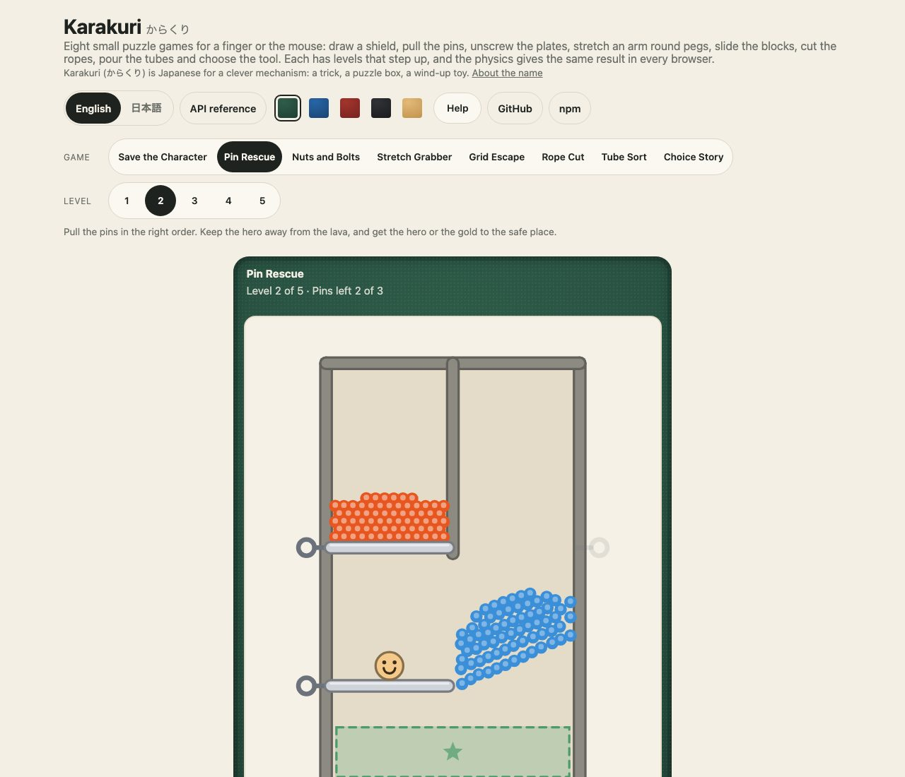
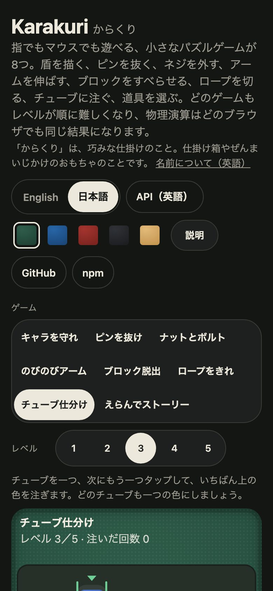

<h1 align="center">Karakuri <sub>からくり</sub></h1>

<p align="center"><strong>Eight small puzzle games for JavaScript and TypeScript.</strong><br>
Draw a shield, pull the pins, unscrew the plates, stretch an arm round pegs, slide the blocks, cut the ropes, pour the tubes and choose the tool: each game played by finger or mouse in any page, each with five levels (four for the story) that step up, a clear win and a clear loss, and a restart. The four physics games share one small deterministic physics core that gives the same frames in every browser. The rules of every game are pure functions on plain data, and every level is proved by the tests. In English and Japanese. No dependencies.</p>

<p align="center">
  <a href="https://github.com/johnmorrisdotca/karakuri/actions/workflows/ci.yml"></a>
  <a href="https://www.npmjs.com/package/@johnmorrisdotca/karakuri"></a>
  <a href="./LICENSE"></a>
  
</p>

<p align="center"><a href="https://johnmorrisdotca.github.io/karakuri/"><strong>Play a level →</strong></a> · <a href="https://johnmorrisdotca.github.io/karakuri/api.html">API reference</a></p>

<p align="center">
  
  
</p>

Karakuri is a set of hyper-casual puzzle games made to be dropped into a page, and the small physics four of them share. Each game
is a controller that holds one level, turns the pointer into the game's moves and draws on a canvas; a player puts it in
the page with one call or one tag, and the rules underneath are plain functions you can run anywhere.

## In 30 seconds

```sh
npm install @johnmorrisdotca/karakuri
```

```ts
import { mountKarakuri } from "@johnmorrisdotca/karakuri/play";

const board = mountKarakuri(document.getElementById("game")!, { game: "tube-sort", level: 2 });
board.status;   // "playing", then "won" or "lost"
```

And in a page, with nothing else to set up:

```html
<script type="module" src="https://cdn.jsdelivr.net/npm/@johnmorrisdotca/karakuri@0/dist/element-define.js"></script>
<karakuri-board game="tube-sort" level="2"></karakuri-board>
```

The rules need no page at all:

```ts
import { tubeSort } from "@johnmorrisdotca/karakuri";
import { TUBE_SORT_LEVELS } from "@johnmorrisdotca/karakuri/levels";

const { solution } = tubeSort.solveTubes(TUBE_SORT_LEVELS[1].tubes);   // a way to win level 2, found by search
```

## Who it is for

- **Game and puzzle sites** that want small games with the rules already right: levels everybody plays alike, a win and a loss that
  mean something, a finger-sized board, and the words in English and Japanese. A game can be shown with its own buttons (`ui: "board"`) and listened to through one event.
- **Anyone who wants a small, deterministic 2D physics** in the browser or on a server: rigid bodies of circles and capsules, rope chains and a
  particle liquid that give the same frames everywhere, held by tests that compare whole simulations bit for bit between Node, Chromium and WebKit.
- **Teachers and parents**: nothing is timed against you except where the game says, the words are plain, nothing worse than a splash ever happens, and a loss always offers another try.

## Features

- **Eight games** (below), each with levels that step up, a clear win and loss and a Restart. Every level of every game is proved by the tests: the winning moves are played on the rules, and so is a way to lose.
- **A deterministic physics core**: a fixed time step, arithmetic and square roots only, so the same inputs give the same frames in every browser and on every server.
- **By finger or mouse**, phone and desk. A game that only needs taps leaves the page its own scrolling; one that reads a drag stops it only on the board. Nothing on a board can be selected, dragged or double-tapped.
- **Fast on a phone**: the physics games run at 60 frames a second on a Chromium phone slowed four times; no blur is drawn anywhere (a blurred shadow cost forty times as much in software rendering).
- **Light and dark** that follow the page, a custom property for each colour, and the family's table cloths.
- **English and Japanese** words for every game, board and button, listed in [docs/strings-ja.md](./docs/strings-ja.md).
- **Zero dependencies**, for the package and for what it draws: every picture is drawn in code.

## The games

| Id | Name | You | Levels | Win | Lose |
| --- | --- | --- | --- | --- | --- |
| `save-the-character` | Save the Character (キャラを守れ) | draw one line | 5 | keep him safe for three seconds | a bee or a rock touches him, or he falls |
| `pin-rescue` | Pin Rescue (ピンを抜け) | tap pins | 5 | the hero (or the gold) is at rest in the safe place | lava or spikes touch the hero |
| `nuts-and-bolts` | Nuts and Bolts (ナットとボルト) | tap screws | 5 | every plate has fallen | the holding slots fill with plates left |
| `stretch-grabber` | Stretch Grabber (のびのびアーム) | lead the arm's tip | 5 | the tip touches the star | any part of the arm touches a red blob or a laser |
| `grid-escape` | Grid Escape (ブロック脱出) | slide blocks | 5 | the key block leaves by the exit | the moves allowed run out |
| `rope-cut` | Rope Cut (ロープをきれ) | swipe across ropes | 5 | the lantern reaches the target or the button | it falls into the pit |
| `tube-sort` | Tube Sort (チューブ仕分け) | tap two tubes | 5 | every filled tube is one colour | no pour that does anything is left |
| `choice-story` | Choice Story (えらんでストーリー) | tap a tool | 4 | the third stage is done | a wrong tool fails the stage (try it again) |

Each game's rules, levels and tests are written up in [docs/](./docs): [Save the Character](./docs/save-the-character.md), [Pin Rescue](./docs/pin-rescue.md), [Nuts and Bolts](./docs/nuts-and-bolts.md),
[Stretch Grabber](./docs/stretch-grabber.md), [Grid Escape](./docs/grid-escape.md), [Rope Cut](./docs/rope-cut.md), [Tube Sort](./docs/tube-sort.md), [Choice Story](./docs/choice-story.md) and
[the physics](./docs/physics.md).

## Use it in your project

The player is `mountKarakuri(host, options)` from `@johnmorrisdotca/karakuri/play`, and the tag is `<karakuri-board>` from
`@johnmorrisdotca/karakuri/element/define` (its class alone is `@johnmorrisdotca/karakuri/element`). The rules of every game are in the main entry
`@johnmorrisdotca/karakuri` (a namespace for each: `gridEscape`, `tubeSort`, `nutsAndBolts`, `pinRescue`, `ropeCut`, `stretchGrabber`, `saveTheCharacter`, `choiceStory`), the level lists in
`@johnmorrisdotca/karakuri/levels`, and the physics core on its own in `@johnmorrisdotca/karakuri/physics`.

```ts
import { mountKarakuri } from "@johnmorrisdotca/karakuri/play";

const board = mountKarakuri(host, {
  game: "rope-cut",          // one of the eight ids above
  level: 3,                  // from 1
  lang: "ja",                // "en" or "ja"; the page's language if left out
  ui: "board",               // "full" (default) draws a bar, a result card and buttons; "board" is the canvas alone
  room: () => window.innerHeight - 280,  // the most height the board may take, if the page keeps more round it than the default allows
  onStatus: ({ level, status, text, info }) => { /* "playing" at the start, then "won" or "lost"; text and info are words in the player's language */ },
});
board.restart();             // the same level again
board.setLevel(4);           // another level of the same game
board.advance(60);           // step the game 60 sixtieths of a second now (with clock: "manual", the only thing that moves time)
board.destroy();
```

The tag takes the same things as attributes: `game`, `level`, `lang`, `ui` and `clock` (`real` or `manual`), fires `karakuri-status` with `{ game, level, status, result, text, info }` in `detail`, and has the methods `restart()` and `setLevel(n)`.

A game of the package is a `Controller`: `createController(game, level)` from `/play` gives one without a page, with `pointerDown`, `pointerMove`, `pointerUp`, `tick` and `draw`, and `snapshot()` for plain data to read.
Everything that thinks about a level is a pure function on plain state in its own namespace: a state in, a new state out.

## API

Every export of every entry point is in the [API reference](https://johnmorrisdotca.github.io/karakuri/api.html), made from the source when the demo is built.

## Theming

The colours are custom properties on `.karakuri`, so a page changes any of them with one line of CSS. They follow `prefers-color-scheme`, and `data-theme` on the root forces either.

| Property | Means | Light | Dark |
| --- | --- | --- | --- |
| `--kk-board` | the floor of the play area | `#f6f1e6` | `#263029` |
| `--kk-deep` | grooves, shadows and the frame | `#e4dcc9` | `#1a211c` |
| `--kk-ink` | outlines and text | `#2b2a28` | `#f1ecdf` |
| `--kk-muted` | quiet marks | `#8a8473` | `#9aa393` |
| `--kk-accent` | the line you draw, the arm, and buttons | `#2f6f55` | `#6fcf97` |
| `--kk-good` | what is safe | `#2f8f5b` | `#6fcf97` |
| `--kk-bad` | what is dangerous | `#c2453a` | `#ef7a6e` |
| `--kk-gold` | gold, keys and targets | `#e0a82e` | `#f0be4a` |
| `--kk-water` | water | `#3b8fd9` | `#5aa9ee` |
| `--kk-lava` | lava | `#e8561f` | `#f27a45` |
| `--kk-stone` | stone | `#8d8a82` | `#a7a399` |
| `--kk-paper` | light colour on top of the others | `#fffdf7` | `#fffdf7` |

## Limits

| What | Limit |
| --- | --- |
| Time step | 1/60 s, in two sub-steps in the rigid-body world |
| Numbers used by the simulation | only `+ - * /` and `Math.sqrt`: no `sin`, `cos`, `atan2`, `hypot` or `pow` |
| Levels | 5 for each game but Choice Story, which has 4 stories of 3 stages: 39 in all |
| Pin Rescue | liquid up to a few hundred particles of 4 units; pins pull in 12 steps |
| Nuts and Bolts | the search takes up to 24 screws |
| Grid Escape | a 6 by 6 board; a position is a base-6 number, so up to 14 blocks |
| Save the Character | one line, of up to the level's ink; a line shorter than 28 units is thrown away |
| Stretch Grabber | the tip moves 2.5 units at a time, so a thin wall cannot be jumped |

## Browser support

Any browser with pointer events and a canvas: current Chrome, Edge, Firefox and Safari, on a phone or a desk. The demo's tests run in Chromium and WebKit, on this Mac and in the Linux image CI uses,
with a finger (Chromium's touch events) and with the mouse.

## Languages

The words are English and Japanese: the games' names and rules, the buttons, every line a game says as it goes, the tools and stories of Choice Story, and what is drawn on the canvas. The Japanese has not yet been read by a native reader: corrections are welcome as a *Fix a translation* issue.

## Roadmap

Sound, more levels for each game and a way to share a level are next. Nothing here is promised for a date.

## Architecture

```text
src/
├── choiceStory.ts
├── choiceStoryView.ts
├── controller.ts
├── draw.ts
├── element-define.ts
├── element.ts
├── games.ts
├── gridEscape.levels.ts
├── gridEscape.ts
├── gridEscapeView.ts
├── index.ts
├── levels.ts
├── mount.ts
├── nutsAndBolts.levels.ts
├── nutsAndBolts.ts
├── nutsAndBoltsView.ts
├── physics-entry.ts
├── physics/
│   ├── bodies.ts
│   ├── fluid.ts
│   ├── geometry.ts
│   └── rope.ts
├── pinRescue.levels.ts
├── pinRescue.ts
├── pinRescueView.ts
├── play-entry.ts
├── ropeCut.levels.ts
├── ropeCut.ts
├── ropeCutView.ts
├── saveTheCharacter.levels.ts
├── saveTheCharacter.ts
├── saveTheCharacterView.ts
├── storyScenes.ts
├── storyTools.ts
├── storyWords.ts
├── stretchGrabber.levels.ts
├── stretchGrabber.ts
├── stretchGrabberView.ts
├── strings.ts
├── style.ts
├── theme.ts
├── tubeSort.levels.ts
├── tubeSort.ts
├── tubeSortView.ts
└── version.ts
```

## The name

Karakuri (からくり) is Japanese for a clever mechanism: the trick of a puzzle box, the hidden gears of a wind-up toy. The games are small mechanisms, and so is the physics under them.

## Where it comes from

These are the kind of small games that fill phones: draw a line, pull a pin, sort some colours, slide blocks out of the way. Their rules are common property and every one here is written in our own words; every picture is drawn in code and every word is the package's own.
The names are plain on purpose, and the games are not copies of any one product: Rope Cut, for one, is a game of its own with a lantern, hooks and a pit.

### The family

<!-- family:start (made by scripts/family-readme.mjs from scripts/family-template.mjs; change those, not this) -->
Karakuri is one of twenty-four packages, each made for the same site, each at
[github.com/johnmorrisdotca](https://github.com/johnmorrisdotca). The code of every one is MIT.

- [Korokoro](https://github.com/johnmorrisdotca/korokoro) (コロコロ): dice, with notation, exact odds, real sounds and the dice of many games. [Demo](https://johnmorrisdotca.github.io/korokoro/).
- [Kyuubu](https://github.com/johnmorrisdotca/kyuubu) (キューブ): a turning cube for the browser, 2×2 to 7×7, with record solves to replay. [Demo](https://johnmorrisdotca.github.io/kyuubu/).
- [Hitotsu](https://github.com/johnmorrisdotca/hitotsu) (一つ): a colour-card shedding game for two to eight, with the house rules people play. [Demo](https://johnmorrisdotca.github.io/hitotsu/).
- [Toranpu](https://github.com/johnmorrisdotca/toranpu) (トランプ): a deck of playing cards, card games with computer players, and solitaires. [Demo](https://johnmorrisdotca.github.io/toranpu/).
- [Tane](https://github.com/johnmorrisdotca/tane) (種): seeded random numbers and daily seeds, the same in every browser and on every server. [Demo](https://johnmorrisdotca.github.io/tane/).
- [Narabe](https://github.com/johnmorrisdotca/narabe) (並べ): one rules engine for abstract board games, from gomoku and Reversi to Go and checkers. [Demo](https://johnmorrisdotca.github.io/narabe/).
- [Tenka](https://github.com/johnmorrisdotca/tenka) (天下): world conquest for two to six, on a map of the real world. [Demo](https://johnmorrisdotca.github.io/tenka/).
- [Kumimoji](https://github.com/johnmorrisdotca/kumimoji) (組み文字): a crossword tile race, in English and Japanese kana. [Demo](https://johnmorrisdotca.github.io/kumimoji/).
- [Tsunagi](https://github.com/johnmorrisdotca/tsunagi) (繋ぎ): a line-joining logic puzzle whose every level has exactly one answer. [Demo](https://johnmorrisdotca.github.io/tsunagi/).
- [Jarajara](https://github.com/johnmorrisdotca/jarajara) (ジャラジャラ): mahjong tiles drawn as SVG, stacked layouts, and the matching solitaire Awase. [Demo](https://johnmorrisdotca.github.io/jarajara/).
- [Suido](https://github.com/johnmorrisdotca/suido) (水道): a pipe puzzle: turn the pieces until the water reaches every drain. [Demo](https://johnmorrisdotca.github.io/suido/).
- [Domino](https://github.com/johnmorrisdotca/domino) (ドミノ): dominoes and Mexican Train. [Demo](https://johnmorrisdotca.github.io/domino/).
- [Kotoba](https://github.com/johnmorrisdotca/kotoba) (言葉): word lists and word-game rules in English, French, German and Japanese. [Demo](https://johnmorrisdotca.github.io/kotoba/).
- [Sugoroku](https://github.com/johnmorrisdotca/sugoroku) (双六): backgammon and its variants, with the doubling cube and match play. [Demo](https://johnmorrisdotca.github.io/sugoroku/).
- [Kazu](https://github.com/johnmorrisdotca/kazu) (数): grid number puzzles: Sudoku and its variants, Futoshiki and Skyscrapers. [Demo](https://johnmorrisdotca.github.io/kazu/).
- [Meikyuu](https://github.com/johnmorrisdotca/meikyuu) (迷宮): mazes on squares, hexagons, triangles and circles, made from a seed and drawn through with a finger or the mouse. [Demo](https://johnmorrisdotca.github.io/meikyuu/).
- [Hikidashi](https://github.com/johnmorrisdotca/hikidashi) (引き出し): a drawer of small Japanese text tools: era dates, kanji numerals, readings and sentence difficulty. [Demo](https://johnmorrisdotca.github.io/hikidashi/).
- [Chizu](https://github.com/johnmorrisdotca/chizu) (地図): maps of the world and of countries' regions, in English and Japanese, with a quiz and callouts. [Demo](https://johnmorrisdotca.github.io/chizu/).
- [Bushu](https://github.com/johnmorrisdotca/bushu) (部首): find a kanji by the parts it is made of. [Demo](https://johnmorrisdotca.github.io/bushu/).
- [Tobiishi](https://github.com/johnmorrisdotca/tobiishi) (飛び石): peg solitaire with nine boards and seeded solvable challenges. [Demo](https://johnmorrisdotca.github.io/tobiishi/).
- [Jirai](https://github.com/johnmorrisdotca/jirai) (地雷): minesweeper on shaped grids with verified no-guess boards. [Demo](https://johnmorrisdotca.github.io/jirai/).
- [Gunjin](https://github.com/johnmorrisdotca/gunjin) (軍人): five hidden-rank strategy games with pass-the-device play. [Demo](https://johnmorrisdotca.github.io/gunjin/).
- [Karakuri](https://github.com/johnmorrisdotca/karakuri) (からくり): eight hyper-casual puzzle games, some of them physics: draw a shield, pull pins, cut ropes, slide blocks, pour tubes. [Demo](https://johnmorrisdotca.github.io/karakuri/).
- [Houseki](https://github.com/johnmorrisdotca/houseki) (宝石): gem and stone matching puzzles: falling triplets, stone collapse, colour chains and gem swap. [Demo](https://johnmorrisdotca.github.io/houseki/).

**This package is Karakuri.** The demos of all twenty-four share one header and footer, so each links the rest.
<!-- family:end -->

## Development

```sh
pnpm install
pnpm check          # lint, types and tests: every level of every game proved, the physics held bit for bit
pnpm test:package   # pack it as npm does, install it in an empty project, import every entry
pnpm test:demo      # build the demo and play every level of every game in a real browser, at a phone's width and a desk's
pnpm pictures       # retake the two pictures above
pnpm docs:make      # rewrite docs/strings-ja.md after changing a word
```

## Contributing

Ideas, bug reports and pull requests are welcome in the [issues](https://github.com/johnmorrisdotca/karakuri/issues). See [CONTRIBUTING.md](./CONTRIBUTING.md).

## Changes

Every release is written up in [CHANGELOG.md](./CHANGELOG.md).

## Licence

[MIT](./LICENSE) © John Morris. The code, the pictures drawn in it and the words are all the package's own; nothing is copied from another game.
